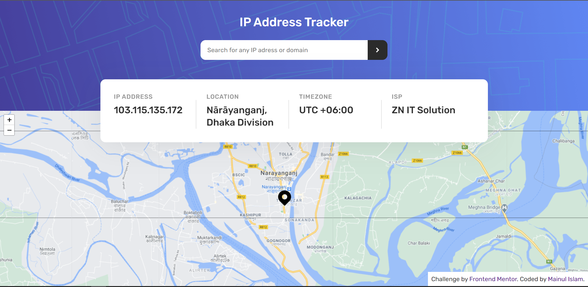

# Frontend Mentor - IP address tracker solution

This is a solution to the [IP address tracker challenge on Frontend Mentor](https://www.frontendmentor.io/challenges/ip-address-tracker-I8-0yYAH0). Frontend Mentor challenges help you improve your coding skills by building realistic projects. 

## Table of contents

- [Overview](#overview)
  - [The challenge](#the-challenge)
- [Links](#links)
- [My process](#my-process)
  - [Built with](#built-with)
  - [Continued development](#continued-development)
- [Author](#author)

## Overview
- This is an IP address tracker app. This website initially loads with users IP address and show some info about their IP and user can also search other IP addresses as well.

### The challenge

Users should be able to:

- View the optimal layout for each page depending on their device's screen size
- See hover states for all interactive elements on the page
- See their own IP address on the map on the initial page load
- Search for any IP addresses or domains and see the key information and location

### Screenshot

### Links

- Solution URL: [View the solution](https://www.frontendmentor.io/solutions/simple-responsive-ip-tracker-app-rZ_5twrxT)
- Live Site URL: [View live site here](https://ip-tracker-v1.netlify.app)

## My process
- I was a little bored and thinking about a vanilla javascript project then I saw a tweet about Frontend Mentor then I find this challenge.
for building this project I have tried to follow the MVC architecture pattern.
I know for this project MVC pattern is overkilling 😅 but never mind I just love this pattern ❤. 

### Built with

- Semantic HTML5 markup
- SCSS/SASS
- Flexbox
- Vanilla JavaScript
- MVC Architecture (for better management)
- Parcel (for bundling)
- [ipify API](https://www.ipify.org/) - A Simple Public IP Address API
- [Leaflet](https://leafletjs.com/) - an open-source JavaScript library
for mobile-friendly interactive maps

## Author

- Facebook - [Mainul Islam](https://facebook.com/main1479)
- Frontend Mentor - [@main1479](https://www.frontendmentor.io/profile/main1479)
- Twitter - [@main1479](https://www.twitter.com/main1479)

